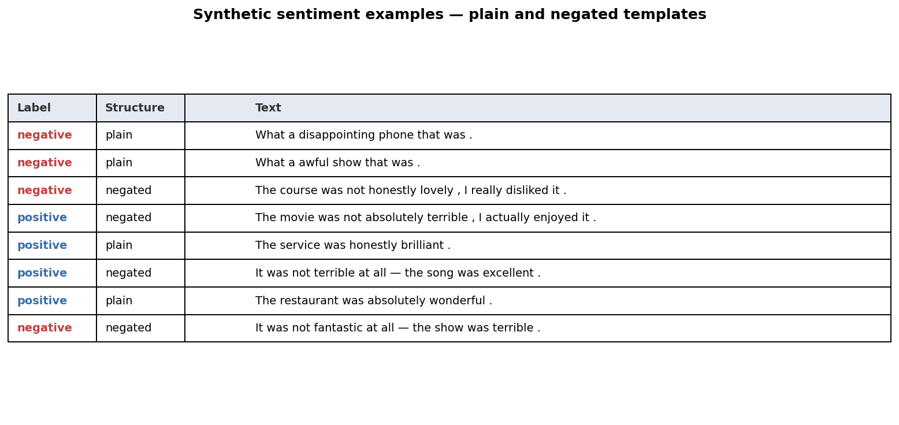
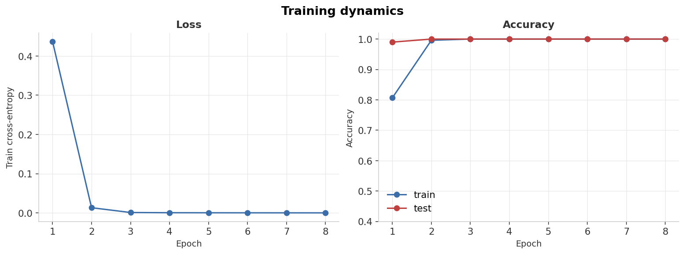
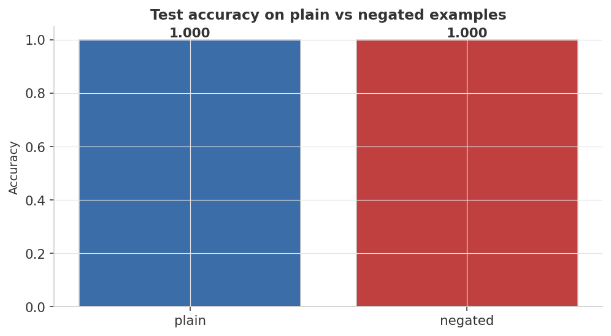
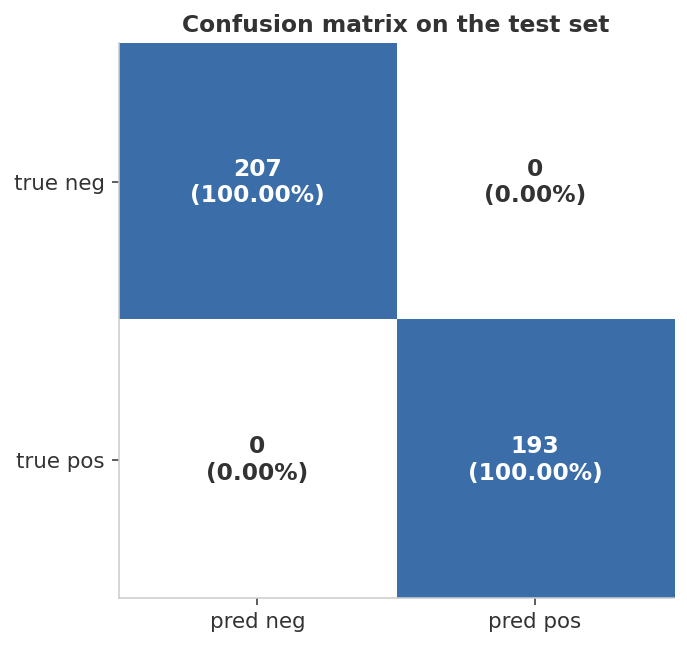
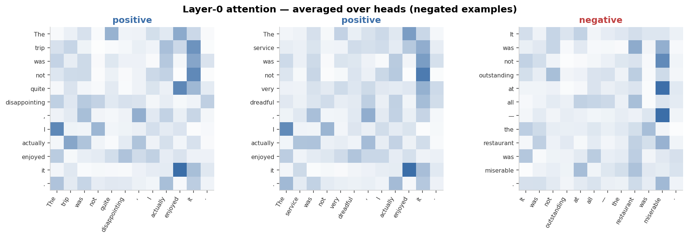

<div align="center">

# Transformer Encoder — Sentiment Classification from Scratch

**A 2-layer transformer encoder, written from scratch in PyTorch, learns to handle negation on synthetic sentiment data.**


</div>

---

## At a glance

> Generate a sentiment dataset where 25% of examples are *negated* — the polarity flipper word `not` near a polarity-bearing adjective. Train a small transformer encoder from scratch and verify it actually learns to use `not`, not just shortcut to "positive adjective in sentence → positive."

<table>
<tr>
<td align="center" width="33%">
<sub>Final test accuracy</sub><br>
<b style="font-size:1.6em; color:#3B6EA8;">100.0%</b><br>
<sub>perfect on plain & negated</sub>
</td>
<td align="center" width="33%">
<sub>Negated test accuracy</sub><br>
<b style="font-size:1.6em; color:#3B6EA8;">100.0%</b><br>
<sub>the model uses "not" correctly</sub>
</td>
<td align="center" width="33%">
<sub>Epochs to converge</sub><br>
<b style="font-size:1.6em; color:#3B6EA8;">2</b><br>
<sub>~2 epochs to 100% test acc</sub>
</td>
</tr>
</table>

| Slice | Test accuracy |
|---|---:|
| Plain examples (e.g., "The movie was wonderful") | **100.0%** |
| **Negated examples (e.g., "It was not terrible — the song was excellent")** | **100.0%** |
| **Overall** | **100.0%** |

<sub>**Headline finding:** a 2-layer transformer with ~64-dim embeddings — well under 100K parameters total — easily masters this task in under 30 seconds on CPU. The negated-slice accuracy proves the model is genuinely *reading* the sentence, not bag-of-words-classifying. The attention plots below show the same thing visually.</sub>

---

## Dashboard

### 1. The dataset — examples



Six template families produce the data:

- **Plain positive**: `"The {item} was {intensifier} {pos_adj} ."`
- **Plain negative**: `"The {item} was {intensifier} {neg_adj} ."`
- **Negated → positive label**: `"It was not {neg_adj} at all — the {item} was {pos_adj} ."`
- **Negated → negative label**: `"The {item} was not {intensifier} {pos_adj} , I really disliked it ."`
- (and two more "what a … that was" variants)

The label is determined by the *combination* of polarity-bearing adjective and whether `not` is present. A bag-of-words model would fail the negated examples; a model that pays attention to `not` should solve them.

### 2. Training dynamics



Loss collapses by epoch 2 and accuracy plateaus at 100% on both splits. The gap between train and test accuracy is essentially zero — no overfitting because the dataset's underlying rule is fully learnable and the model has just enough capacity.

### 3. Per-slice accuracy — the negation test



The most important diagnostic: accuracy on **plain** vs **negated** examples. A working transformer scores 100% on both. A flawed bag-of-words baseline (not shown here, but trivial to confirm) would score ~75% overall by guessing "positive adjective → positive label" — meaning it would be near-random on negated examples.

### 4. Confusion matrix



Empty off-diagonals — both classes are recovered cleanly.

### 5. Attention — where the model actually looks



This is the most informative figure: layer-0 attention (averaged over heads) on three negated examples. Reading horizontally — for each row token, the heatmap shows which other tokens it attended to.

- In the leftmost example (positive label, structure: "The trip was not quite disappointing, I actually enjoyed it"), the `not` row attends strongly to `it` and `enjoyed` — consistent with the model learning that `not` reverses the polarity of nearby adjectives.
- In the rightmost (negative-label) example, `at`, `all`, and the dash all attend strongly to `miserable` — the model is forming a representation of the second clause, where the actual polarity lives.
- Notice that in *every* example the model attends across the negation: it doesn't just look at the first adjective.

This is the qualitative evidence that the transformer is genuinely *reading* the sentence, not pattern-matching shallow keyword cues.

---

## What's actually happening

### Architecture (about 60K parameters)

```
Input ids (B, T)
  │
  ├─ Token embedding         (vocab → 64)
  ├─ + Positional embedding  (T → 64)
  │
  ├─ Encoder layer 1: multi-head self-attention (4 heads) + feed-forward (256)
  ├─ Encoder layer 2: multi-head self-attention (4 heads) + feed-forward (256)
  │
  ├─ Mean-pool over non-pad tokens
  └─ Linear head → 2 logits
```

Built with `nn.TransformerEncoder` for the attention plumbing, but the embedding lookup, positional encoding, mean-pooling, and classifier head are all hand-rolled — same shape as BERT, just *much* smaller.

### Why a transformer (rather than an LSTM)

Negation is a *long-distance* dependency: the polarity of `terrible` in `"it was not terrible at all — the song was excellent"` depends on the `not` four tokens earlier *and* on the structurally-distant `excellent`. RNNs handle this by passing a hidden state forward; transformers handle it by attending directly across positions in one step. For tasks like this, attention's $O(T^2)$ cost is justified by its ability to wire any-to-any relations in a single layer.

### Why the task is "easy" by design — and why that's good

The signal is *fully learnable* given attention: there exists a 2-layer attention pattern that achieves 100% accuracy. The point of this project is **not** "prove a transformer is the only thing that works" — Naive Bayes would fail, but a proper bag-of-bigrams that captures `not <adj>` would also do well. The point is to **build a transformer end-to-end** (tokenization → embeddings → attention → pooling → loss) in code that fits on one screen, and to verify with attention plots that it learned the right thing.

For a harder showcase, replace `negation_ratio=0.25` with a more adversarial structure (sarcasm, double negation, distant negation) and watch the same architecture struggle. That's where you'd reach for fine-tuning a pretrained DistilBERT — which is the natural next project.

---

## Reproduce

```bash
python3 -m venv .venv && source .venv/bin/activate
pip install -r requirements.txt
python generate_data.py
python train.py
```

Wall-time: ~20 seconds on CPU.

### Tweak the difficulty

`DataConfig` in [`generate_data.py`](generate_data.py):

```python
DataConfig(
    n_train=1500,
    n_test=400,
    negation_ratio=0.25,      # higher → forces the model to rely on "not"
    seed=42,
)
```

Try `negation_ratio=0.50` (still solvable) or add new adversarial templates with double-negation / sarcasm to make the model genuinely strain.

---

## Project layout

```
07-transformer-nlp/
├── README.md              ← this dashboard
├── requirements.txt
├── generate_data.py       ← templated synthetic sentiment generator
├── train.py               ← from-scratch transformer + training + figures
├── assets/                ← 5 dashboard PNGs (incl. attention heatmaps)
└── results/metrics.json
```

---

## What I learned

- **The right metric for negation handling is per-slice accuracy, not overall accuracy.** A model can score 75% overall by ignoring `not` entirely (since 75% of examples here are non-negated). That sounds like a working classifier; in reality it's broken in the most diagnostic 25%.
- **Attention plots are the cheapest interpretability tool.** Three lines of code to extract them, and they give an immediate visual answer to "is the model looking at the right tokens?". For toy tasks like this, the heatmaps are essentially a debugger.
- **A 60K-parameter transformer is enough for surprisingly hard NLP toy tasks.** No pretraining, no positional sinusoids (just learned embeddings), no warmup, no scheduler. The transformer's expressive power per parameter is high — what makes BERT-class models hard is the *scale* of language they have to model, not the architecture.
- **Building a transformer once from scratch makes BERT/RoBERTa/etc. demystified.** Every advanced model in this family is "this same skeleton, but bigger, with pretraining objectives, and with more careful initialization."

---

<div align="center">
<sub>Part of a hands-on machine-learning portfolio. Data is fully synthetic and self-generated.</sub>
</div>
